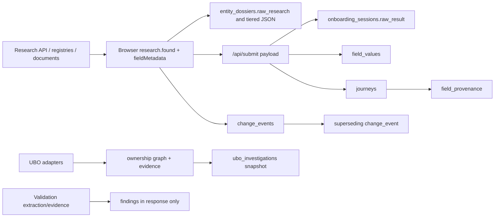

# Provenance Across the KYC Application — Current-State Diagnostic

Date: 2026-07-27  
Scope: read-only assessment of the current repository. No remediation was performed.

## 1. Executive assessment

| Capability | Maturity | Finding |
|---|---:|---|
| Research and pre-fill | Partial | Browser rows carry source, URL, tier, verification status, retrieval time, method and confidence, but scalar metadata is not sent to the submission API. |
| Customer confirmation/correction | Partial | Checkbox/correction state and applicant overrides are captured; ordinary scalar kept/unchecked/edited lineage is lost at persistence. |
| Applicant identity | Confirmed | Agent value, customer value, action and source attributes are derived and persisted. |
| Stakeholders | Confirmed/Partial | Rich stakeholder lineage is persisted, but name-based fields and heuristic actions are not a durable statement model. |
| Documents | Partial | Permanent Blob URL and filename exist; no content hash, immutable version, page-level extraction link or database document-row write is implemented by the upload route. |
| Ownership/UBO | Partial | Evidence-linked graph calculation and immutable investigation snapshots exist; source configuration/versioning and evidence identity are incomplete. |
| Validation/LOA | Partial | Findings carry evidence IDs and execution/rule-pack metadata in memory; persistence and replay are absent. |
| Change intelligence | Confirmed | Append-only events, supersession, source context and deterministic policy outcome are implemented and tested. |
| RFI/remediation | Missing/Partial | Document-required and analyst-review workflows exist, but there is no general RFI case/thread/evidence-response model. |
| End-to-end audit/replay | Missing | No single trace spans research → confirmation → submission → validation → remediation; validation replay explicitly throws. |

Overall maturity: **Partial, with isolated strong components rather than a unified provenance system**.

The main control weakness is not absence of metadata in the UI. It is loss of identity and lineage at boundaries. `src/App.js:2536-2550` constructs `fieldMetadata`, but `src/App.js:2578-2598` omits it from `/api/submit`; `api/submit.js:28-33` documents the same gap. Scalar provenance is consequently inferred from journey type and final value (`api/submit.js:190-218`), not reconstructed from the evidence actually shown to the customer.

## 2. Capability map

Labels: Confirmed = implemented path; Partial = material gaps; Inferred = design intent only; Demo-only = synthetic/lab; Unused = defined but no active write/read; Missing = absent; Blocked = could not verify without live services.

| Area | Capture | Persistence | Display | Replay/audit | Status |
|---|---|---|---|---|---|
| Research result | `src/App.js:1225-1522` | dossier JSON/cache JSON | source badges `3310-3569` | cache timestamp only | Partial |
| Scalar field | `fieldMetadata` state `425` | heuristic `field_provenance` | source badge | no full history | Partial |
| Applicant | workflow derivation `src/workflows/applicantWorkflow.js:124-183` | rich provenance + override event | prefilled fields | override timeline | Confirmed |
| Stakeholder | enriched research rows | rich provenance rows | People/source UI | no immutable statement version | Partial |
| Uploaded document | file + Blob URL | Blob only through route | links/warnings | no hash/version chain | Partial |
| Dossier | tiered arrays + raw research | `entity_dossiers` JSONB | dossier sections | replacement snapshots, not lineage | Partial |
| UBO | evidence + graph + resolutions | KV cache/audit + DB snapshot | lab/API | immutable snapshots, deterministic recalc | Partial |
| Validation | extraction evidence refs/findings | none found | validation lab | replay unimplemented | Partial |
| Change | customer dialogue event | append-only DB | dashboard/read APIs | supersession chain | Confirmed |
| RFI | doc-required outcome | change event only | notice/amendment list | no response lineage | Missing/Partial |

## 3. Actual data model

Confirmed schema: `db/migrations/003_persistence_now.sql:42-106` defines journeys, events and field provenance; `005_entity_dossiers.sql` defines dossier snapshots; `007_change_events.sql` defines append-only changes; `009_ubo_investigations.sql` defines UBO snapshots.

Important divergence:

- `events` is defined but the active customer-change path writes `change_events`; no general journey-event writer was found.
- `documents` is expanded in migration 003, but `/api/upload-document` only writes a Blob and returns URL/filename (`api/upload-document.js:38-61`).
- `policy_decisions` exists in schema, while change decisions are embedded in `change_events` and validation decisions are response objects.

## 4. Seven end-to-end traces

### 4.1 Research → pre-fill → submission

1. Research/document/registry results are normalized with `source`, `sourceUrl`, `sourceTier`, `verificationStatus`, `fetchedAt`, method and confidence (`src/App.js:1362-1369`, `1519-1522`).
2. UI shows tier badges and timestamps (`3310-3569`).
3. Submission builds rich `fieldMetadata` (`2536-2550`) but does not transmit it (`2578-2598`).
4. Server persists scalar fields using final value and a journey-level layer heuristic (`api/submit.js:190-218`).

Result: **Partial**. A reviewer cannot prove which source supported a submitted scalar or what the customer did with the proposed value.

### 4.2 Applicant pre-fill → override

Candidate rows preserve person/source attributes (`src/workflows/applicantWorkflow.js:54-119`). Submit-time derivation compares agent and customer values and labels accepted/overridden/provided (`124-183`). The API writes both `field_provenance` (`api/submit.js:251-273`) and `session_timeline` override events (`495-521`).

Result: **Confirmed**, with no immutable source document/evidence ID and no source URL in the applicant provenance insert.

### 4.3 Stakeholder discovery → customer amendment

Stakeholder source fields survive into submit payload (`src/App.js:2415-2468`) and are stored with agent/final values and kept/unchecked/edited (`api/submit.js:220-246`). Customer change dialogue separately produces append-only events.

Result: **Partial**. Two provenance representations are not linked by a common field/evidence/version identity.

### 4.4 Document upload → extraction

The browser POSTs multipart uploads (`src/App.js:5865`, `5933`, `5960`); the route stores bytes in public Vercel Blob and returns URL/filename (`api/upload-document.js:38-61`). Browser extraction creates document-tier rows (`src/workflows/documentWorkflow.js:45-106`).

Result: **Partial**. No SHA-256, byte size, MIME, immutable document ID/version, extraction model/prompt, page/bounding box, or database `documents` write is present in this route.

### 4.5 Ownership source → UBO determination

Adapters emit evidence and relationship statements (`agents/ubo/companiesHouseOwnershipAdapter.js:52`, `webResearchOwnershipAdapter.js:23-38`, `documentExtractionAgent.js:5`). Orchestration resolves conflicting statements, builds the graph, calculates ownership/control and determines UBOs (`uboOrchestrator.js:48-110`). DB audit stores graph, evidence, resolutions, determination and budget (`uboDatabaseAudit.js:6-25`).

Result: **Partial**. Strong trace shape, but resolution can fall back to the first candidate, confidence is sometimes constant, evidence IDs are locally generated, and persisted `source_config` is hard-coded to web research.

### 4.6 Validation evidence → decision

Validation selects a versioned rule pack, extraction, evidence, validators, guidance and aggregate result (`agents/validation/engine/validationEngine.js:33-82`). Findings include evidence IDs and execution/validator/rule-pack metadata (`validatorPipeline.js:24-43`; `contracts/validationTypes.js:63-116`).

Result: **Partial**. No persistence path was found and `replay/replayHarness.js:1-3` explicitly says replay is not implemented.

### 4.7 Customer change → remediation

`ChangeDialogue` captures intent/registry answers and builds one decision event (`src/components/changeDialogue/ChangeDialogue.jsx:87-121`). `writeEvent` is append-only, validates closed vocabularies, and requires validated supersession (`src/changeIntelligence/events/writeEvent.js:46-138`). Read helpers preserve history and derive current state (`readEvents.js:15-99`).

Result: **Confirmed** for change-decision audit. **Missing/Partial** for subsequent RFI issuance, evidence response, analyst disposition and closure.

## 5. Terminology and status matrix

| Term | Actual meaning | Concern |
|---|---|---|
| `sourceTier`: document/tier1/tier2/tier3 | browser trust hierarchy | Change events normalize this to numeric tiers; validation uses evidence types. |
| `verificationStatus`: verified/probable/indicative | presentation category derived from tier | Not an independent verification event. |
| `confidence`: high/low or numeric | extraction/relationship certainty | Mixed scales and occasionally fixed values. |
| `layer`: L3_ai/L4_customer | persisted provenance origin | Scalar layer is inferred from journey, not field action. |
| customer action: accepted/overridden/provided | applicant fields | Stakeholders use kept/unchecked/edited; scalars lack persisted action. |
| validation PASS/FAIL/REVIEW | rule result | Not stored; not equivalent to source verification status. |
| UBO resolved/partial/needs_customer_evidence | investigation completeness | Separate from field and validation statuses. |
| change workflow | policy routing outcome | `UNDECIDED` is explicitly supported and queryable. |

## 6. Source taxonomy and conflict behavior

Browser taxonomy is configurable and classifies document, government/registry, company-owned and third-party sources (`src/App.js:1362-1369`; `lib/seedConfig.js:150-290`). Self-source results retain tier/source/URL (`api/self-source.js:53-100`). This is useful but not canonical across subsystems.

Conflict handling:

- Research scalar conflict: higher-tier ordering/display exists; no persisted candidate set or resolution record.
- UBO statements: grouped by owner/entity/type and passed to `resolveEvidence`; decision and combined evidence IDs are returned (`uboOrchestrator.js:48-76`). This is the best explicit conflict record.
- Customer change concurrency: a superseded event cannot be superseded again; caller must resolve concurrent edits (`writeEvent.js:84-108`).
- Dossier saves: new snapshots are inserted; there is no explicit supersession/version relationship (`api/save-dossier.js:53-139`).

## 7. Auditability, replay and UI

Audit strengths:

- Append-only change events with full history.
- UBO immutable investigation snapshots.
- Applicant override timeline.
- Raw research retained in dossier/session JSON.

Audit weaknesses:

- Submission intentionally returns HTTP 200 on database failure (`api/submit.js:311-317`, `576-586`), so user-visible success does not guarantee an audit record.
- Journey-model writes and individual provenance writes are non-fatal, allowing partial audit records.
- `field_provenance` is delete-and-reinsert on resubmission (`api/submit.js:193`), so it is a snapshot, not immutable history.
- Cache keys identify query inputs, not the underlying source snapshot (`lib/researchCache.js:27-92`).
- No validation replay; no universal correlation ID crossing subsystems.

UI: source labels, links, tier badges and timestamps are visible on research/dossier pages (`src/App.js:3310-3569`, `6296-6333`; `src/components/dossier/DossierSection.jsx:39-43`). The UI does not expose a complete field history, conflict candidates, evidence excerpts, validation execution version, or a cross-journey audit timeline.

## 8. Test coverage and runtime verification

Static coverage is strongest for:

- applicant provenance characterization (`src/__tests__/characterization.workflows.test.js:96-137`);
- append-only change invariants and reads (`src/changeIntelligence/events/tests/*`);
- LOA rule/validator behavior (`agents/validation/tests/*`);
- UBO standalone/recalculation scripts.

Missing or weak:

- integration assertion that `fieldMetadata` reaches persisted scalar provenance;
- upload fingerprint/version tests;
- validation persistence/replay tests;
- cross-system correlation and end-to-end lineage;
- database failure/partial-write reconciliation.

Live Neon rows, Vercel Blob immutability and deployed UI were **Blocked** by the diagnostic’s local/read-only scope and external-service dependence. Conclusions about those are based on executable write paths, not production data inspection.

## 9. Final control questions

| Question | Answer |
|---|---|
| 1. Can every submitted scalar be tied to its exact source? | No |
| 2. Is the original agent value retained after customer change? | Partial |
| 3. Is the customer action recorded for every field? | No |
| 4. Are documents durably identified and fingerprinted? | No |
| 5. Can an extraction be tied to document page/region? | Partial (validation contract/lab only) |
| 6. Are model and prompt versions retained? | Partial |
| 7. Are source retrieval times retained? | Partial |
| 8. Are conflicting source claims retained and resolved explicitly? | Partial (UBO strongest) |
| 9. Can a reviewer reconstruct a UBO determination? | Partial/Yes for stored investigation snapshots |
| 10. Can a reviewer reconstruct a validation decision? | Partial in response; No after-the-fact persistence |
| 11. Can a customer amendment be replayed without deleting history? | Yes in change intelligence |
| 12. Can an RFI be traced through request, evidence, decision and closure? | No |
| 13. Is there one canonical provenance vocabulary? | No |
| 14. Is there a complete end-to-end replay for an application? | No |

