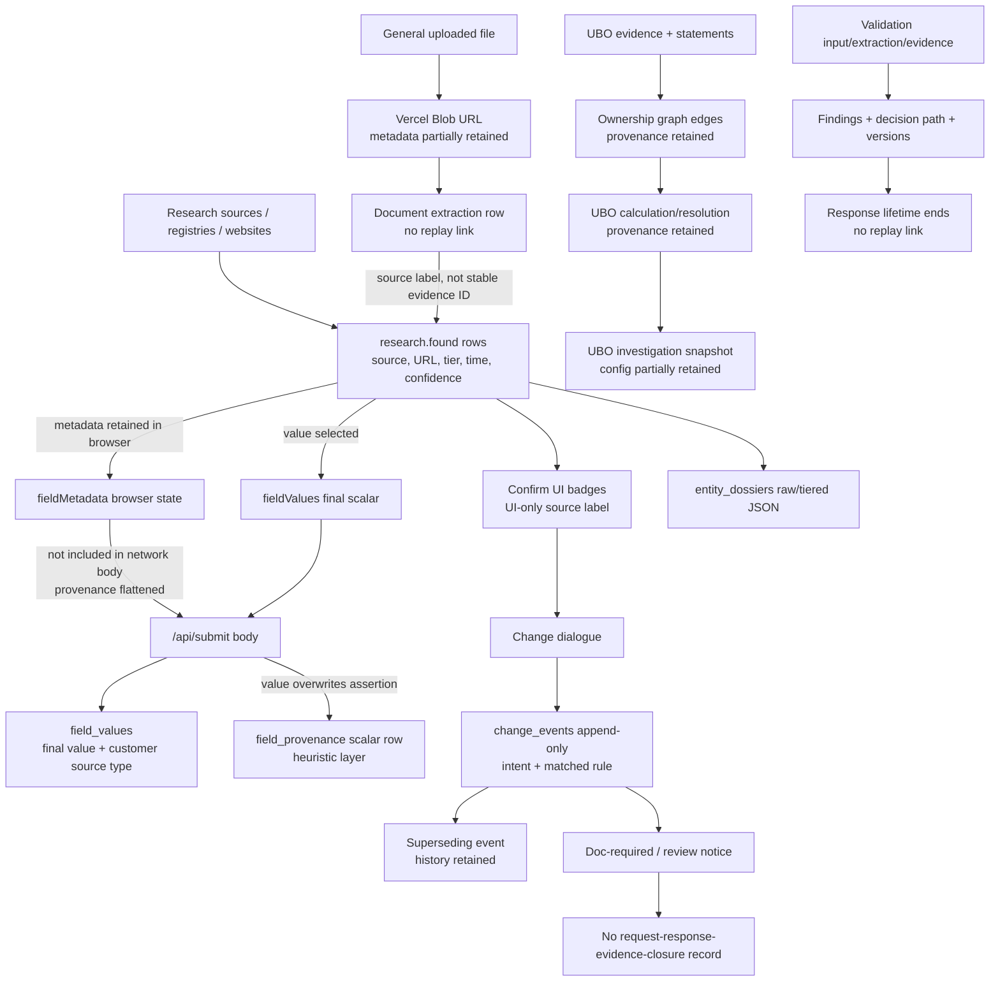

# Provenance Diagnostic Synthesis

Date: 2026-07-27  
Scope: consolidation of the three read-only diagnostic reports against the current repository. No production code was changed.

## 1. Reconciliation of the existing reports

The reports agree on the central conclusion: provenance metadata is generated in several modules, but there is no application-wide evidence, assertion, run, or decision identity. Their apparent differences mostly come from describing different scopes: a mechanism may be implemented inside one feature while still being absent from the general application path.

Duplicated findings have been consolidated here:

- scalar `fieldMetadata` is created and displayed but not sent to `/api/submit`;
- general document upload retains a Blob URL but not a persistent fingerprint record;
- validation produces evidence-linked, version-labelled results in memory but has no persistence or replay;
- UBO and change intelligence retain more decision context than the ordinary application-field path;
- module-specific identifiers prevent end-to-end tracing;
- source tier, verification status, confidence and customer action have inconsistent vocabularies.

### Diagnostic inconsistencies requiring review

| Finding | Report A | Report B | Code Evidence | Recommended Interpretation |
|---|---|---|---|---|
| Applicant provenance maturity | Current-state report calls it “Confirmed.” | Gap register requires canonical immutable evidence identity. | `src/workflows/applicantWorkflow.js:124-183`; `api/submit.js:251-273`, `495-521` | Confirmed for agent/customer value comparison and override recording; Partial as evidence provenance because it lacks an evidence ID, source URL and immutable source artefact. |
| Stakeholder provenance maturity | Executive table says “Confirmed/Partial.” | Code inventory lists the supporting paths as active. | `src/App.js:2415-2468`; `api/submit.js:220-246` | The write path is confirmed, but the model is partial: actions are inferred and rows are not linked to versioned assertions or immutable evidence. |
| Document fingerprinting | Current-state report says uploaded documents have no hash. | Reusable-foundation prompt anticipates document fingerprinting. | General path: `api/upload-document.js:38-61`; ownership path: `agents/ubo/documentExtractionAgent.js:4-5` | No fingerprint exists in the general upload path; an ownership-specific SHA-256 metadata helper exists and is potentially reusable, but is not application-wide. |
| UBO snapshots are immutable | Current-state report describes immutable investigation snapshots. | Code inventory qualifies database audit as Confirmed/Partial. | `agents/ubo/uboPersistence.js:24-31`; `agents/ubo/uboDatabaseAudit.js:6-25`; migration `009_ubo_investigations.sql` | Append-only snapshot creation is implemented, but live deployment of migration 009 and production writes were not verified; source configuration in the DB snapshot is incomplete. |
| Dossier “replacement snapshots” | Current-state report says replacement snapshots lack lineage. | `save-dossier` actually inserts a new row rather than updating one. | `api/save-dossier.js:53-139` | “Independent snapshots without predecessor/supersession links” is more accurate than “replacement.” |
| Change events capture value changes | Current-state report calls change audit Confirmed. | Builder states `afterValue` is null in capture mode and a later superseding write is an open question. | `src/components/changeDialogue/buildChangeEvent.js:15-18`, `39-66` | Confirmed for intent and routing-decision audit; only Partial for a complete value-change ledger because the resolved after-value write is not established by this slice. |
| `field_provenance` preserves history | Gap register says mutable records overwrite history. | Current-state report notes delete-and-reinsert. | `api/submit.js:193`; migration `003_persistence_now.sql:84-106` | It is a current submission snapshot, not immutable field history; resubmission can erase the prior derived rows for that journey. |
| Validation evidence location | Current-state report says page/region linkage is partial in the validation contract/lab. | Extraction orchestrator always returns `pages: []`. | `agents/validation/extraction/extractionOrchestrator.js:1-17`; validators accept `evidenceRefs` | The contract can carry evidence references, but the built-in extractor does not produce page/region evidence. Treat current page-level provenance as test/input-supplied only, not implemented extraction behavior. |
| Change events include an actor | “Audit event” language can imply actor attribution. | Code inventory describes a strong append-only change record. | `src/changeIntelligence/events/schema.js:21-54`; migration `007_change_events.sql` | Change events have no actor or actor-type columns. Customer intent implies a customer interaction but does not prove actor identity. |
| P0-03 document fingerprinting | Gap register makes all upload fingerprinting P0. | Current-state report identifies Blob storage as partial. | `api/upload-document.js:38-61`; `agents/ubo/documentExtractionAgent.js:4` | P0 remains justified for compliance documents used as evidence, because the general path can present a retained URL without proving byte identity; the ownership helper reduces implementation uncertainty, not risk. |
| Research “verification” | UI groups tier-derived rows as verified/probable/indicative. | Terminology matrix says status is presentation-derived. | `src/App.js:1362-1371`, `5983-5985`, `6331-6333` | “Verified” currently means classified as a high-authority source tier; it does not consistently represent an independent verification act. |
| `events` versus `change_events` | Database model includes general `events`. | Active inventory centres on `change_events`. | migration `003_persistence_now.sql`; `api/change-events.js:18-47` | `events` is a defined but currently unused general event surface; `change_events` is the active feature-specific audit path. |

## 2. Current provenance model

This is the model the application actually implements today, not a proposed future model.

| Concept | Current Representation | Code Location | Persistent? | Consistently Used? | Main Limitation |
|---|---|---|---|---|---|
| Source | Strings/URLs plus browser `sourceTier`; numeric tier/provider/type in change events | `src/App.js:1362-1371`; `src/changeIntelligence/events/schema.js:34-37` | Partial | No | Source identity, channel and authority are conflated and vocabularies differ. |
| Evidence | Research row, URL, validation evidence item, UBO evidence object or uploaded Blob | `src/App.js:1519-1522`; `agents/validation/contracts/validationTypes.js:29-58`; `agents/ubo/*Adapter.js` | Some modules | No | No shared evidence envelope or stable cross-module ID. |
| Assertion | Implicit in a research row or explicit as an ownership relationship statement | `research.found`; `agents/ubo/uboOrchestrator.js:48-76` | UBO snapshot; otherwise mostly no | No | Ordinary scalar values are stored without first-class candidate assertions. |
| Field value | `research.found[].value`, `gapRef.current`, `fieldValues`, `field_values`, `field_provenance.final_value` | `src/App.js`; `api/submit.js:190-218`, `469-488` | Yes | Partially | Final values outlive the assertions that produced them. |
| Extraction | Browser document extraction rows; validation skeleton extraction; UBO document relationships | `src/workflows/documentWorkflow.js:45-106`; `agents/validation/extraction/extractionOrchestrator.js:1-17`; `agents/ubo/documentExtractionAgent.js:5` | Partial | No | No common extraction-run object or prompt/model/version linkage. |
| Derivation | UBO graph edges/chains and calculations; assorted mapping code | `agents/ubo/ownershipGraphBuilderAgent.js:20-50`; `ownershipCalculationAgent.js:5-47` | UBO snapshot | Only in ownership | Scalar normalisation and source selection are not recorded as derivation steps. |
| Validation | In-memory findings with evidence IDs, rule path, guidance and execution metadata | `agents/validation/contracts/validationTypes.js:61-108`; validators | No production persistence found | Within validation only | Cannot retrieve or replay a historical validation. |
| Confirmation | Checkbox state, corrections, applicant actions and change dialogue intent | `src/App.js:425`, `3569`; `src/workflows/applicantWorkflow.js:124-183` | Applicant/change paths only | No | Ordinary scalar confirmation is not durably transmitted. |
| Verification | Tier-derived `verificationStatus`; registry claim/recheck fields; validator outcomes | `src/App.js:1366-1367`; `src/changeIntelligence/events/schema.js:37-42` | Partial | No | Independent verification, source rank and rule result are different concepts sharing similar language. |
| Decision | Validation finding decision, UBO resolution/determination, change workflow outcome | `RecipientValidator.js:28-99`; `uboOrchestrator.js:67-76`; `buildChangeEvent.js:56-66` | UBO/change yes; validation no | No | No shared decision ID, version contract or causal links. |
| Change event | Append-only `change_events` row with supersession | `writeEvent.js:46-138`; migration `007_change_events.sql` | Yes | Within change intelligence | No actor identity, evidence ID, request ID or guaranteed final after-value. |
| Audit event | `session_timeline`, UBO audit snapshot, `change_events`; general `events` schema unused | `api/submit.js:495-521`; `uboPersistence.js:24-31`; `writeEvent.js` | Yes, feature-specific | No | Multiple unrelated audit stores and semantics. |
| Agent run | Validation execution IDs; UBO investigation snapshot/log; research cache result | `validatorPipeline.js:37-43`; `uboDatabaseAudit.js:6-25`; `lib/researchCache.js:39-91` | Partial | No | No shared run identity crossing research, extraction, UBO and validation. |
| Rule or rule-pack version | Validation `rulePackVersion` and `validatorVersion`; UBO rules passed at runtime | `validationEngine.js:33-48`; validators; `uboOrchestrator.js:80-88` | Validation no; UBO config incomplete | No | Effective rule/config/model versions are not uniformly persisted. |

## 3. Provenance layers

Scores: 0 absent; 1 implied or UI-only; 2 partially implemented; 3 implemented but inconsistent; 4 reliably implemented.

| Area | Origin | Evidence | Transformation | Decision | Reproducibility | Visibility |
|---|---:|---:|---:|---:|---:|---:|
| Research | 3 | 2 | 1 | 1 | 1 | 3 |
| Application scalar fields | 2 | 1 | 0 | 1 | 0 | 2 |
| Customer confirmation | 2 | 0 | 1 | 2 | 0 | 2 |
| Analyst overrides | 1 | 0 | 0 | 1 | 0 | 0 |
| Document upload | 2 | 2 | 0 | 0 | 1 | 2 |
| Document extraction | 2 | 1 | 1 | 1 | 0 | 2 |
| Stakeholders | 3 | 2 | 2 | 2 | 1 | 3 |
| Ownership evidence | 3 | 3 | 3 | 3 | 2 | 1 |
| Ownership graph | 3 | 3 | 4 | 3 | 3 | 1 |
| UBO calculation | 3 | 3 | 4 | 3 | 3 | 1 |
| Validation agent | 2 | 2 | 2 | 3 | 0 | 2 |
| RFIs | 1 | 0 | 0 | 1 | 0 | 1 |
| Audit history | 3 | 2 | 2 | 2 | 1 | 2 |

### Explanations for scores of 0, 1 or 2

- Research — Evidence 2: URLs and raw result JSON are retained, but source bytes/payload snapshots and stable evidence IDs are not consistently stored.
- Research — Transformation 1: normalisation and tier classification occur in code but are not recorded as run steps.
- Research — Decision 1: source ordering is visible in sorting, but candidate selection is not persisted as a decision.
- Research — Reproducibility 1: cache/model metadata helps debugging but does not retain exact external inputs and configuration.
- Application scalar fields — Origin 2: origin exists in browser metadata but is flattened at submission.
- Application scalar fields — Evidence 1: a source URL or label may be displayed, but final stored scalars do not link to retained evidence.
- Application scalar fields — Transformation 0: no persisted extraction/normalisation chain exists.
- Application scalar fields — Decision 1: the final value implies selection, but the selection reason and competing values are absent.
- Application scalar fields — Reproducibility 0: the persisted scalar cannot recreate the source-to-value path.
- Application scalar fields — Visibility 2: customers see badges before submit, but analysts cannot rely on a complete persisted lineage.
- Customer confirmation — Origin 2: the interaction is represented in check/correction state and stronger applicant-specific metadata.
- Customer confirmation — Evidence 0: confirmation is not linked to an evidence object.
- Customer confirmation — Transformation 1: correction becomes a final field value, but the transition is not uniformly recorded.
- Customer confirmation — Decision 2: applicant and change-dialogue decisions are captured, while ordinary scalar confirmations are not.
- Customer confirmation — Reproducibility 0: there is no durable complete confirmation record for every field.
- Customer confirmation — Visibility 2: the customer sees the confirmation UI; historical confirmation is not generally visible.
- Analyst overrides — Origin 1: analyst identity is implied by dossier/pre-boarding context rather than recorded per override.
- Analyst overrides — Evidence 0: no general analyst-override-to-evidence link was found.
- Analyst overrides — Transformation 0: the override transformation is not a first-class persisted derivation.
- Analyst overrides — Decision 1: some before/after context may exist in feature stores, but no general analyst decision object exists.
- Analyst overrides — Reproducibility 0: the exact decision cannot be rerun.
- Analyst overrides — Visibility 0: no consolidated analyst override history UI was found.
- Document upload — Origin 2: browser workflow and filename imply the source, but uploader/actor and evidence classification are not persisted by the route.
- Document upload — Evidence 2: bytes are retained in Blob, but the general path has no stored hash/version ledger.
- Document upload — Transformation 0: upload itself records no transformation.
- Document upload — Decision 0: no acceptance or evidence-use decision is recorded by the upload route.
- Document upload — Reproducibility 1: the Blob URL can retrieve content, but byte identity and version are not proven by application metadata.
- Document upload — Visibility 2: links and storage-failure warnings are visible, but evidence metadata is not.
- Document extraction — Origin 2: output rows identify a document source, but no shared document ID is guaranteed.
- Document extraction — Evidence 1: extracted values may cite the document label; page/region evidence is absent in the built-in extractors.
- Document extraction — Transformation 1: method is labelled, but run/model/prompt/normalisation steps are not durably recorded.
- Document extraction — Decision 1: extraction confidence exists, but acceptance criteria and alternatives are not retained.
- Document extraction — Reproducibility 0: exact extraction cannot be recreated from stored versions/configuration.
- Document extraction — Visibility 2: document badges appear, but extraction lineage does not.
- Stakeholders — Evidence 2: source URL/tier/time are stored, but evidence identity and artefact version are missing.
- Stakeholders — Transformation 2: enrichment and payload shaping are visible in code, not as a persistent derivation chain.
- Stakeholders — Decision 2: kept/unchecked/edited is inferred and stored, but conflict resolution is not explicit.
- Stakeholders — Reproducibility 1: raw research helps reconstruction but does not pin exact evidence and code versions.
- Ownership evidence — Reproducibility 2: snapshots retain substantial inputs/outputs, but actual source configuration and all version data are incomplete.
- Ownership evidence — Visibility 1: the lab/API can expose it, but no general compliance lineage UI was found.
- Ownership graph — Visibility 1: graph data exists but is not exposed as a general application audit view.
- UBO calculation — Visibility 1: determinations/explanations exist in result structures, but user-role-specific lineage presentation is limited.
- Validation agent — Origin 2: document/application context is accepted, but the skeleton extractor and production integration do not establish a durable origin chain.
- Validation agent — Evidence 2: evidence IDs propagate when supplied; built-in page/region evidence and storage are absent.
- Validation agent — Transformation 2: extraction and deterministic validator paths exist in memory, not as persisted run lineage.
- Validation agent — Reproducibility 0: replay explicitly throws and no validation history store exists.
- Validation agent — Visibility 2: lab output is detailed; durable production history is absent.
- RFIs — Origin 1: `doc_required` or analyst-review routing implies why remediation is needed.
- RFIs — Evidence 0: no RFI-to-response-evidence object exists.
- RFIs — Transformation 0: no request/response/assessment lifecycle is modelled.
- RFIs — Decision 1: a routing outcome exists, but issuance, analyst disposition and closure decisions do not.
- RFIs — Reproducibility 0: there is no complete RFI case to replay.
- RFIs — Visibility 1: notices and derived document lists exist, not an end-to-end RFI history.
- Audit history — Evidence 2: some events retain source context or snapshots, but audit mechanisms do not share evidence IDs.
- Audit history — Transformation 2: UBO snapshots and change decisions retain steps, while scalar transformations do not.
- Audit history — Decision 2: feature decisions are recorded unevenly across stores.
- Audit history — Reproducibility 1: histories support investigation but not full deterministic application replay.
- Audit history — Visibility 2: feature dashboards/reads exist, but no consolidated application audit timeline exists.

## 4. Scalar submission gap

### Concrete lifecycle: `incorporation_date`

1. The field is defined as a research field in `src/pipeline.js:252`.
2. A research or document result is normalized into a row carrying `field`, `value`, `source`, `sourceUrl`, `sourceTier`, `verificationStatus`, `fetchedAt`, `method` and `confidence` (`src/App.js:1362-1371`, `1519-1522`).
3. The result lives in `research.found`; associated entries live in `fieldMetadata` state (`src/App.js:425`).
4. On Confirm, `checks[idx]` records whether the proposed value is accepted; unchecking creates a correction input and can launch `ChangeDialogue` (`src/App.js:3569-3578`).
5. On submit, the final scalar is placed in `fieldValues`; corrected fields create manual `finalMeta` entries (`src/App.js:2374-2399`).
6. The complete local `payload` includes `fieldMetadata` (`src/App.js:2536-2546`), but the body sent to `/api/submit` includes `fieldValues` and omits `fieldMetadata` (`2578-2598`).
7. `api/submit.js` writes `field_values` with `source_type='customer'` (`469-488`) and writes scalar `field_provenance` with the same final/customer value and a journey-level layer heuristic (`190-218`).
8. No general analyst override path links a subsequent scalar change to the original research assertion; change intelligence can record an interaction, but its capture event initially has `afterValue: null`.
9. Downstream consumers therefore receive the final scalar or dossier raw JSON, not a stable selected assertion linked to exact evidence.

### Before submission: actual frontend row shape

The following is representative of the properties the normalization code actually constructs; the values are illustrative, while property names are from `src/App.js:1362-1371` and `1519-1522`.

```js
{
  field: "incorporation_date",
  value: "2015-03-12",
  source: "Companies House",
  sourceUrl: "https://find-and-update.company-information.service.gov.uk/...",
  sourceTier: "tier1",
  verificationStatus: "verified",
  fetchedAt: "2026-07-27T10:00:00.000Z",
  method: "web_research",
  confidence: "high"
}
```

The local submission payload also has a `fieldMetadata` array, but that array is not in the network body:

```js
{
  fieldValues: {
    incorporation_date: "2015-03-12"
  },
  fieldMetadata: [
    {
      fieldId: "incorporation_date",
      source: "Companies House",
      sourceUrl: "https://find-and-update.company-information.service.gov.uk/...",
      sourceTier: "tier1",
      fetchedAt: "2026-07-27T10:00:00.000Z",
      verificationStatus: "verified"
    }
  ]
}
```

### After submission: actual server normalization

The sent body contains:

```js
{
  fieldValues: {
    incorporation_date: "2015-03-12"
  }
}
```

The resulting scalar provenance insert is equivalent to:

```js
{
  field_name: "incorporation_date",
  final_value: "2015-03-12",
  customer_value: "2015-03-12",
  layer: "L3_ai",       // inferred from journey type
  model_version: costSummary?.model
}
```

At that boundary the following are lost or become unprovable for the stored scalar:

| Attribute | Loss point | Result |
|---|---|---|
| Original source | omitted from `/api/submit` body | Lost from scalar row |
| Source identifier | no canonical ID exists | Missing before persistence |
| Evidence identifier | no scalar evidence ID exists | Missing |
| Retrieval timestamp | `fieldMetadata` omitted | Lost |
| Extraction run | no run ID on row/body | Missing |
| Original value | only applicant/stakeholder paths retain it reliably | Lost for ordinary scalar |
| Customer confirmation | checkbox state not submitted as scalar action | Lost |
| Customer correction | final value survives; manual metadata does not reach server | Reason/original value lost |
| Analyst override | no general linked scalar override contract | Missing/feature-specific |
| Competing assertion | candidates are not persisted as assertions | Lost |
| Confidence | `fieldMetadata` omitted | Lost |
| Verification state | local payload has it; API body omits it | Lost |
| Change reason | dialogue may create a separate event, but no stable link to scalar provenance | Disconnected |

### Root cause

The primary cause is **multiple causes**: the frontend keeps rich metadata separate from the final value; the submission API contract omits that metadata; backend normalization substitutes a journey-level heuristic; the database schema can store some provenance but has no first-class assertion/evidence relationship; and update logic deletes/reinserts provenance snapshots.

### Consequence

The application cannot prove which exact source or artefact supported a submitted ordinary scalar, which value the agent originally proposed, whether the customer affirmatively accepted or corrected it, why one assertion won over another, or whether the displayed “verified” state was still applicable to the final submitted value.

## 5. Validation replay gap

### Input-to-result trace

1. `createValidationRequest` accepts a document, extraction, evidence, market, application/research context, rule context, validator metadata and execution metadata (`validationTypes.js:27-59`).
2. `ValidationEngine.validate` loads a rule pack by market and document type (`validationEngine.js:31-38`).
3. If no rule context is supplied, the engine constructs one with rule-pack ID/version and active rule parameters (`39-48`).
4. If no extraction is supplied, the skeleton extractor copies document name/type/size/text/fields and returns empty pages plus provider `skeleton` (`extractionOrchestrator.js:1-17`).
5. Evidence is taken from the request or extraction (`validationEngine.js:61-65`).
6. The pipeline invokes each validator with context, rule context and generated execution metadata (`validatorPipeline.js:24-45`).
7. Validators emit decision paths, evidence IDs, failure reasons, customer/analyst guidance, validator version and rule-pack version.
8. Guidance is aggregated into a result containing status, evidence, findings, guidance and extracted facts (`validationEngine.js:74-82`; `resultAggregator.js`).
9. No validation persistence route/table/write was found.
10. `replayValidation()` always throws “Historical replay is not implemented in Phase 1” (`replayHarness.js:1-3`).

### Replay requirements

| Replay Requirement | Present? | Stored Where | Missing Detail | Impact |
|---|---|---|---|---|
| Exact input facts | In result while in memory | `result.extracted` | No durable validation execution store | Historical rerun unavailable |
| Exact evidence | Conditional | `result.evidence`, finding `evidenceIds` | Evidence may be caller-supplied; no durable artefact/version guarantee | References can become meaningless after response lifetime |
| Validator version | Yes in finding | `finding.execution.validatorVersion` | Not persisted | Cannot prove historical validator version later |
| Rule-pack version | Yes in finding/context | `ruleContext`, finding execution | Not persisted with a history record | Cannot retrieve exact historical rules later |
| Jurisdiction | Yes in request/context | requirement context/result market | No durable run record | Historical jurisdiction context unavailable |
| Effective date | No explicit policy effective date | Rule-pack JS modules | Only semantic version; no effective-from timestamp/hash | Cannot establish which policy was legally effective |
| Configuration | Partial | `activeRules[].parameters`, application context | No persisted complete request/config snapshot | Rerun may use changed context |
| Result | Yes in response | `ValidationResult` | No persistence | Outcome disappears unless caller stores it |
| Failure reason | Yes in finding decision/message | response object | No persistence | Not a durable compliance explanation |
| Generated guidance | Yes in response | `guidance`, finding guidance | No persistence/version | Cannot prove what guidance was shown |
| Extraction provider/model/prompt | Provider only, skeleton | `extractionMetadata.provider` | No model, prompt, prompt hash or extractor version | Extraction cannot be reproduced |
| Execution/run identity | Generated | finding `executionId`, optional `validationRunId` | IDs are not saved or correlated to application/document | No cross-system trace |

### Validator-specific assessment

- **Recipient Validator:** in memory, it is the richest example. It records compared inputs, normalized comparison path, evidence IDs, status, reason, customer/analyst guidance, timestamps and versions (`RecipientValidator.js:20-99`). It is not reproducible after the response because neither input/evidence nor finding is persisted.
- **Other implemented validators:** Signature, Date, Validity, Required Field and Authority follow the same finding contract and propagate evidence IDs/versions. Their deterministic logic is testable, but they have the same persistence and replay gap.
- **Demo/lab behaviour:** supplied extraction/evidence objects and fixed execution IDs in tests make the output look replay-ready; the validation lab can display the full object. This is a transient debugging/characterization surface.
- **Production behaviour:** no durable production validation execution path was found. The built-in extractor is a skeleton, and validation is not connected to an auditable application-wide run record.

Current validation history is **not a history**. The transient result is a good **outcome record and debugging object**, but it is neither a durable compliance audit record nor a reproducible decision record.

## 6. Why change events are strongest

The `change_events` mechanism is strongest because it has a dedicated append-only schema, a single guarded writer, closed vocabularies, supersession validation, full-history readers and tests asserting that history cannot be silently updated or deleted.

| Attribute | Captured? | Detail |
|---|---|---|
| Entity | Partial | `dossierId`/`submissionId` provide case context; no separate entity ID/name. |
| Field | Yes | `fieldId` and `fieldClass`. |
| Before value | Yes | JSONB `beforeValue`. |
| After value | Partial | Schema supports it; capture-mode builder deliberately writes null. |
| Actor | No | No actor ID column. |
| Actor type | No | No actor-type column. |
| Timestamp | Yes | Server-assigned `created_at`. |
| Reason | Partial | Customer intent, registry claim, escalation reason and matched rule; no free-standing reason/evidence rationale. |
| Source | Yes/Partial | Source type/provider/tier and verifiability describe the presented value. |
| Evidence | No | No evidence ID or artefact link. |
| Correlation/request ID | Partial | Submission/dossier IDs correlate to a case, but no request/run/decision ID. |
| Affected downstream decisions | Partial | Workflow, document type, EDD and escalation are recorded; later consumers are not causally linked. |

It reliably supports **knowing that a change interaction occurred**, the field and prior value, the customer’s stated intent, and the deterministic workflow decision. It partially supports **knowing why it changed** through intent, registry claim and matched rule. It does not establish **what retained evidence supported the new value**, and it cannot fully **reproduce the decision** without a versioned ruleset/configuration snapshot and final after-value. Its strength is audit structure, not complete evidence provenance.

## 7. Disconnected provenance implementations

| Mechanism | Module | Identifier Used | Persistence | Links to Other Mechanisms? | Main Problem |
|---|---|---|---|---|---|
| Form field source metadata | `src/App.js` `research.found`/`fieldMetadata` | field string/index | Browser state; dossier JSON sometimes | Weak link by field name | Dropped from scalar submit body |
| Source badges/citations | `src/App.js`, `DossierSection.jsx` | field/index + URL | UI; dossier JSON | Reads research metadata | A label/URL is not immutable evidence |
| Research cache | `lib/researchCache.js` | normalized query cache key | Neon | Returns full result to research path | Cache identity is not source/evidence identity |
| General uploaded document | `api/upload-document.js` | random-suffix Blob URL | Vercel Blob | URL copied into browser/dossier | No application document ID/hash/version row |
| Ownership document fingerprint | `agents/ubo/documentExtractionAgent.js` | random UUID `documentId`, SHA-256 | Only if included in later UBO snapshot | Links ownership evidence/edges | Ownership-specific and not used by general upload |
| Document extraction metadata | `src/workflows/documentWorkflow.js`; validation extractor | field name/provider | Browser/result only | Source label linkage | No shared extraction-run ID/version/page anchor |
| Applicant provenance | `applicantWorkflow.js`; `field_provenance`; `session_timeline` | field ID/person ID/session ID | Neon | Linked through session/journey | No evidence ID/source URL in persisted applicant provenance |
| Stakeholder provenance | `App.js`; `api/submit.js` | stakeholder field + stakeholder ID | Neon `field_provenance` | Journey-linked | Action inferred; no assertion/evidence version |
| Validation results | `agents/validation/*` | execution ID, validation run ID, evidence IDs, rule IDs | Not found | Request-local only | Detailed but transient |
| Change events | `src/changeIntelligence/events/*` | event ID, submission/dossier/field, supersedes ID | Neon | Case/field links only | No actor/evidence/run/version links |
| UBO evidence/graph | `agents/ubo/*` | adapter evidence ID, statement/edge/node IDs | KV/Neon snapshot | Strong within UBO result | IDs and semantics are ownership-specific |
| UBO audit snapshots | `uboPersistence.js`, `uboDatabaseAudit.js` | audit UUID or investigation row + identity hash | KV/Neon | Contains graph/evidence/result | No application-wide run/decision correlation |
| RFI/remediation fragments | Change dialogue, amendment documents, dossier reseed | change event/submission/dossier IDs | Change events/dossier | Partial case linkage | No request-response-evidence-closure identity |

Answers:

- Shared evidence identifier: **No**.
- Shared assertion identifier: **No**.
- Shared agent-run identifier: **No**.
- Shared decision identifier: **No**.
- Cross-module trace: **Only partially through session, journey, submission or dossier IDs; not evidence-to-decision end to end**.
- Identifier stability after submission/normalisation: **Field names and case IDs often survive, but browser indexes, generated validation execution IDs, local adapter evidence IDs and Blob URLs do not form a guaranteed stable lineage contract**.

This diagnostic identifies **13 provenance-like mechanisms** and **9 materially disconnected identifier systems**: field/research, cache, Blob/document, session/journey, applicant/stakeholder, validation execution/evidence, change event, UBO evidence/graph/investigation, and RFI/dossier workflow.

## 8. Consolidated root causes

| Root Cause | Symptoms | Affected Modules | Existing Code That Could Be Reused |
|---|---|---|---|
| No shared provenance contract | Different shapes/IDs for evidence, source, decision and run | All | Validation contracts; UBO evidence/edge shapes |
| Metadata lost at submission | Scalar source/action/status/time disappear | `App.js`, `api/submit.js`, `field_provenance` | Applicant provenance derivation and inserts |
| Values stored without assertions | Final scalar replaces candidate claims | Research, `field_values`, dossier | UBO relationship statements/resolution |
| Snapshot/update logic is not immutable history | `field_provenance` delete/reinsert; unlinked dossier rows | Submit/dossier | Change-event append/supersede pattern |
| Evidence and source are conflated | URL/label treated as provenance | Research/UI/doc upload | UBO document metadata and evidence objects |
| Status terminology is conflated | “verified,” confidence, validation PASS and UBO resolved look comparable | UI/research/validation/UBO | Change closed vocabularies and schema guards |
| Version/run lineage is incomplete | Cannot recreate research/extraction/validation | Research, extraction, validation, UBO | Validation execution/version fields; UBO snapshots |
| UI provenance is detached from persistence | Badges show detail that final rows lack | Confirm/dossier/submit | Dossier display and field metadata |
| Module-specific identifiers | No cross-feature evidence/run/decision link | All provenance mechanisms | Existing journey/submission/dossier bridge IDs |
| Audit events are detached from evidence/decisions | Events show activity but not complete supporting artefact/causality | Timeline/change/RFI | Change event history readers and supersession |
| No general conflict model | Competing scalar assertions disappear | Research/scalars/stakeholders | UBO `resolveEvidence` candidate ranking |
| Demo/lab paths are stronger than production paths | Tests can supply perfect evidence IDs/config that production does not persist | Validation/UBO lab | Characterization tests and deterministic engines |

There are **12 consolidated root causes**. Several original gaps share the first three causes rather than representing independent platform problems.

## 9. Revised P0/P1 gap ranking

| Gap ID | Original Priority | Revised Priority | Reason | Root Cause |
|---|---:|---:|---|---|
| P0-01 Scalar provenance dropped at submit | P0 | P0 | The UI can present source/verification while the stored final scalar silently loses the supporting lineage. | Metadata lost at submission |
| P0-02 No canonical immutable evidence identity | P0 | P0 | Evidence references cannot be trusted across modules or normalized records. | No shared provenance contract |
| P0-03 Uploads lack fingerprint/version ledger | P0 | P0 | General compliance-document bytes cannot be proven to be the exact artefact later relied upon. | Evidence/source conflation |
| P0-04 Submission audit silently partial/absent | P0 | P0 | A successful customer screen can coexist with failed or partially failed audit writes. | Audit detached; non-atomic persistence |
| P0-05 Validation not durable/replayable | P0 | P0 | A compliance decision can be emitted without a durable record of exact inputs, evidence and versions. | Version/run lineage incomplete |
| P1-01 `field_provenance` snapshot delete/reinsert | P1 | P0 | Material prior provenance can be overwritten without recovery for the journey. | Mutable snapshot logic |
| P1-02 No common correlation chain | P1 | P1 | Traceability breaks across otherwise retained records, but does not alone create a false value. | Module-specific identifiers |
| P1-03 Dossier snapshots lack lineage | P1 | P1 | Prior snapshots exist as rows but cannot be causally ordered or tied to a source run. | Snapshot lineage missing |
| P1-04 No full RFI lifecycle | P1 | P1 | Material remediation lacks request-to-evidence-to-decision traceability. | Audit detached from decisions |
| P1-05 UBO source config inaccurately persisted | P1 | P1 | UBO output is substantial but cannot be exactly reconstructed from the recorded config. | Version/run lineage incomplete |
| P1-06 Conflict handling inconsistent | P1 | P1 | Competing assertions are discarded outside UBO, preventing review and reproduction. | No general conflict model |
| P1-07 Version population incomplete | P1 | P1 | Decisions and extractions cannot be reproduced under their historical code/policy/model context. | Version/run lineage incomplete |

Revised totals: **6 P0 gaps** and **6 P1 gaps**. P1-01 is elevated because delete-and-reinsert can irrecoverably remove material provenance, satisfying the P0 criterion directly.

## 10. Reusable foundations

| Existing Capability | Reusable? | What It Solves | What It Does Not Solve | Risk of Generalising It |
|---|---|---|---|---|
| Change events | Yes, structurally | Append-only history, supersession, current-state derivation, enum guards | Evidence identity, actor, run/version lineage, final after-value guarantee | Treating every provenance object as a user change would distort semantics |
| General document upload | Limited | Durable byte storage and URL | Fingerprint, metadata ledger, versioning, actor/evidence link | Public URL may be mistaken for immutable evidence identity |
| Ownership document fingerprinting | Yes, with adaptation | UUID, SHA-256, retrieval metadata | General document persistence and lifecycle | Source type is ownership/registry-coupled |
| Ownership evidence staging | Yes conceptually | Evidence and relationship statements exist before graph calculation | General scalar assertion schema and durable staging store | Ownership relationships are graph-specific and percentages/control dominate the shape |
| Ownership statement validation/resolution | Yes conceptually | Candidate ranking, retained alternatives in explanations, deterministic selection | Policy governance and non-ownership comparisons | Reliability formula may be inappropriate for all KYC facts |
| Graph-edge evidence | Yes for derived relationships | Links calculations to evidence through edge IDs/chains | Simple scalar confirmation and document validation | Forcing all facts into a graph can add needless complexity |
| Deterministic UBO recalculation | Yes | Recomputes downstream ownership/UBO from graph/evidence without external search | Historical config/version completeness | Ownership thresholds and path math are domain-specific |
| Extraction-run metadata | Weak foundation | Provider/method labels and some timestamps | Run ID, model/prompt/version, page anchors, persistence | Existing skeleton may appear more complete than it is |
| Research citations | Partial | User-visible source labels, URLs, tiers and retrieval times | Immutable snapshots, candidate assertions and resolution | URLs can change and tier classification can be mistaken for verification |
| Validation result structures | Yes | Evidence-linked findings, decision path, guidance, execution and versions | Persistence, effective-date governance and replay | Contract may become LOA-centric if generalized directly |
| Audit logging | Yes in pieces | UBO snapshots, applicant timeline and change history | Unified causality/evidence/correlation | Combining stores without semantic boundaries can create an opaque “event bucket” |

The ownership pipeline is the best model for **staging assertions before downstream mutation**, retaining evidence IDs on relationship statements, resolving conflicts deterministically, carrying provisional/unresolved paths, and recalculating derived results. It is not a drop-in general provenance platform: its assertion shape assumes owner-to-owned-entity edges, its scoring embeds ownership-source assumptions, and its determination logic is coupled to ownership percentages, control and jurisdictional thresholds.

The **strongest reusable foundation overall is the change-event append/supersede discipline**, complemented by the ownership pipeline’s evidence-to-assertion-to-derivation pattern.

## 11. Current application provenance map



## 12. Five principal design questions

## Decision 1: Should assertions become first-class records?

### Current behaviour

Ordinary fields are final values with attached or transient metadata; only ownership has explicit competing statements before resolution.

### Option A

Create first-class immutable assertions linked to evidence, with final field values pointing to selected assertions. This supports conflict retention and derivation but adds a new core concept.

### Option B

Keep one field record and append provenance/change events containing prior candidates. This is simpler but makes candidate comparison and reuse less explicit.

### Recommendation from the diagnostic

Provisionally choose Option A for sourced or derived compliance facts, while permitting direct customer-only fields to use a lighter attestation path. This requires product and architecture agreement.

### Modules affected

Research, `App.js` submission, `api/submit.js`, dossier persistence, UBO adapters/graph, validation and change intelligence.

## Decision 2: What does customer confirmation create?

### Current behaviour

Checkbox state may accept or reject a value; applicant confirmation becomes accepted/overridden/provided provenance, while ordinary scalar confirmation is lost.

### Option A

Confirmation creates a new customer assertion that competes with the agent assertion.

### Option B

Confirmation creates an attestation/decision referencing the existing assertion; correction creates a new assertion.

### Option C

Confirmation only changes the selected final value and emits an event.

### Recommendation from the diagnostic

Provisionally choose Option B because acceptance and factual authorship are different: a customer can attest to an agent-sourced assertion without becoming its source. This requires product and architecture agreement.

### Modules affected

Confirm UI, gap inputs, applicant workflow, submission API, `field_provenance`, change dialogue and analyst views.

## Decision 3: Is evidence immutable, and what is its identity?

### Current behaviour

General uploads have Blob URLs; research uses URLs/labels; UBO document metadata can create a UUID and SHA-256; validation accepts caller-supplied evidence IDs.

### Option A

Evidence identity is a content-addressed immutable artefact version (hash plus metadata), with later versions as separate objects.

### Option B

Evidence identity is an application UUID, with hash optional and external URLs allowed to mutate.

### Option C

Use hybrid identity: UUID for lifecycle/correlation and mandatory content hash/snapshot identity when bytes or payloads are retained.

### Recommendation from the diagnostic

Provisionally choose Option C. It supports external registries and webpages as well as uploaded bytes without pretending a URL is immutable. This requires product, security, privacy and architecture agreement.

### Modules affected

Upload API, Blob storage, research/cache, document extraction, validation evidence, UBO evidence and retention controls.

## Decision 4: How should overrides and current state coexist with history?

### Current behaviour

Change events append/supersede; `field_provenance` deletes/reinserts; dossiers insert unlinked snapshots; analyst overrides are feature-specific.

### Option A

Use append-only assertion/decision events and derive current state for all compliance fields.

### Option B

Keep mutable current-state tables plus immutable history/audit tables linked transactionally.

### Option C

Use append-only only for high-risk fields and snapshots for low-risk fields.

### Recommendation from the diagnostic

Provisionally choose Option B unless expected scale and query patterns justify full event sourcing. It preserves operational reads while making history explicit. This requires product and architecture agreement.

### Modules affected

`field_values`, `field_provenance`, dossiers, change events, applicant timeline, analyst workflows and downstream document requirements.

## Decision 5: What must be frozen for reproducible automated decisions?

### Current behaviour

Validation carries validator/rule-pack versions in memory; UBO snapshots retain graphs/evidence but incomplete source configuration; research retains model/cache metadata unevenly.

### Option A

Persist semantic versions only and depend on source control to recover code/config.

### Option B

Persist complete input/evidence snapshots plus rule/model/prompt/config versions and hashes for every automated decision.

### Option C

Apply full freezing only to material compliance decisions; retain lighter operational metadata elsewhere.

### Recommendation from the diagnostic

Provisionally choose Option C with an explicit materiality policy, and use Option B for validation, UBO determination, verification and analyst override decisions. This requires compliance, product and architecture agreement.

### Modules affected

Research pipeline/cache, extraction, validation engine/rule packs, UBO orchestration/persistence, policy decisions and audit export.

## Current-state conclusion

The application can reliably prove that certain customer change interactions occurred, which field they concerned, the prior value, the stated intent and the workflow rule selected.  
It can also reconstruct much of an individual UBO investigation when the stored evidence, graph, resolutions, determination and budget snapshot are present.  
Applicant and stakeholder paths retain more agent/customer comparison data than ordinary scalar fields.  
The application only appears to prove ordinary scalar “verification” because source badges and tier-derived labels shown before submission are not preserved with the final stored scalar.  
Validation results appear audit-ready in the lab because they contain evidence IDs, decision paths and versions, but those results are not persisted or replayable.  
General uploaded documents are retained by URL, but the application does not prove their byte identity through the general upload path.  
Provenance is irreversibly lost most seriously when `fieldMetadata` is omitted from the `/api/submit` request and backend normalization replaces it with a final value plus journey-level heuristic.  
Additional history can be lost when `field_provenance` is deleted and recreated.  
The strongest structural foundation is the append-only, superseding change-event mechanism.  
The ownership pipeline provides the strongest domain example of evidence-linked assertions, conflict resolution and deterministic recalculation.  
Neither is sufficient alone because change events lack evidence identity and ownership structures are domain-coupled.  
Before an Evidence Platform is designed, the organisation must decide whether assertions are first-class, how confirmation and overrides are represented, how immutable evidence is identified, how current state relates to history, and which inputs/versions must be frozen for replay.  
Those choices require product, compliance and architecture agreement before implementation planning.

